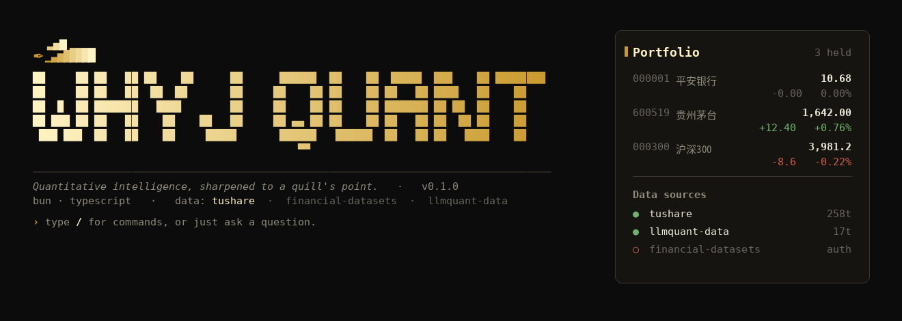

# WhyJ Quant

交互式量化分析终端 — AI Agent 驱动，slash commands 操作，本地数据存储。

[](https://www.npmjs.com/package/whyj-quant)



## Quick Start

```bash
npm i -g whyj-quant
whyj
```

第一条命令 — 无需任何配置，bundle 了示例数据：

```
Q > /claw --code 000001.SZ
```

输出平安银行的 OHLCV 快照。要启用 AI Agent 分析，配置 API key：

```bash
# .env 文件 (项目根目录)
ANTHROPIC_API_KEY=sk-ant-...
TUSHARE_TOKEN=your_token        # A 股数据 (可选)
```

然后：

```
Q > 分析平安银行的动量因子和风险指标
```

## Commands

| 命令 | 说明 |
|------|------|
| `/claw --code CODE` | 股票/基金快照 (离线可用) |
| `/skill list` | 已安装技能列表 |
| `/skill trigger --name fetch_bars --code CODE` | 直接执行技能 |
| `/add stock --code CODE --name NAME` | 加入自选 |
| `/add list` | 查看自选 |
| `/benchmark` / `dashboard` | 策略跑分看板 |
| `/config` | 配置向导 |
| `/mcp connect` | 连接数据源 |
| `/help` | 命令参考 |

无 `/` 前缀直接输入自然语言 → AI Agent 分析。

## Dev

```bash
bun install
bun run src/index.ts
bun run src/index.ts -- -c "//help"   # one-shot mode
```

## Docs

- [CLI Manual](./docs/cli-manual.md)
- [Agent System Spec](./docs/agent-system-spec.md)
- [Design System (NewForm)](./DESIGN.md)
